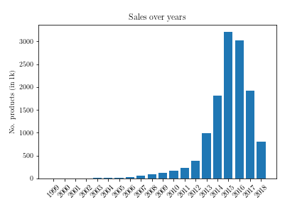
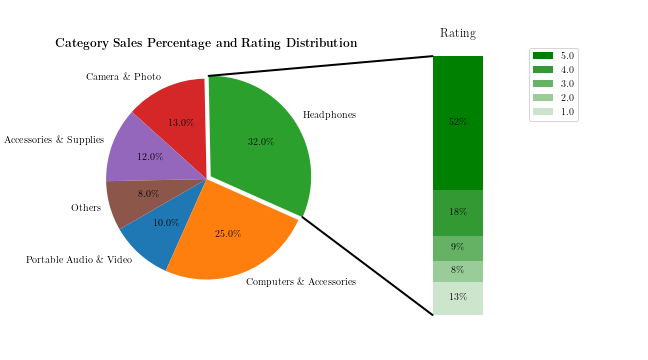

# Project: Amazon Electronics Products Sales

This notebook demonstrates a comprehensive sales analysis of an Amazon electronics products dataset with dimensions 1.3M x 10.

The analysis aims to address the following questions:
- What are the categories of electronic products?
- Find the Top-10 users that bought the most in each category.
- Analyze sales in a certain year, grouped by categories.
- Given a brand, identify the categories in which it has products.
- Determine the categories with the highest market competition.

## **Approach**

A systematic approach is followed throughout my analysis, with each step accompanied by insights into the dataset: 
- **Data Cleaning:** 
Data cleaning involved scanning the input dataset to identify columns where NaN values occupy the majority of rows.
These columns were deemed unlikely to provide meaningful insights and were thus ignored in further analysis.

- **Handling Timestamp:**
Due to inconsistencies between the timestamp and year columns, the timestamp (including the date) is chosen as the reference time for each purchase.

- **Data Processing:**
The solution is implemented in `Python`, utilizing `Pandas` for data manipulation and `Matplotlib` for visualization.

## **Dataset Details**

The dataset encompasses Amazon electronics sales data spanning from 1999 to 2018. It is available on [Kaggle](https://www.kaggle.com/datasets/edusanketdk/electronics/data).

## **Analysis and Insights**
By addressing the following queries, insights into various aspects of the input dataset are gained:

- **Categories of Electronic Products:**
        Identified the unique categories of products available in the dataset.

- **Top-10 Users per Category:**
        Determined the top 10 users who purchased the most in each category.

- **Yearly Sales Grouped by Categories:**
        Analyzed and visualized sales data for specific years, grouped by product categories.

- **Brand-wise Product Categories:**
        For each brand, identified the categories in which its products are listed.

- **Market Competition Analysis:**
        Determined which categories have the highest market competition based on the number of unique brands.

